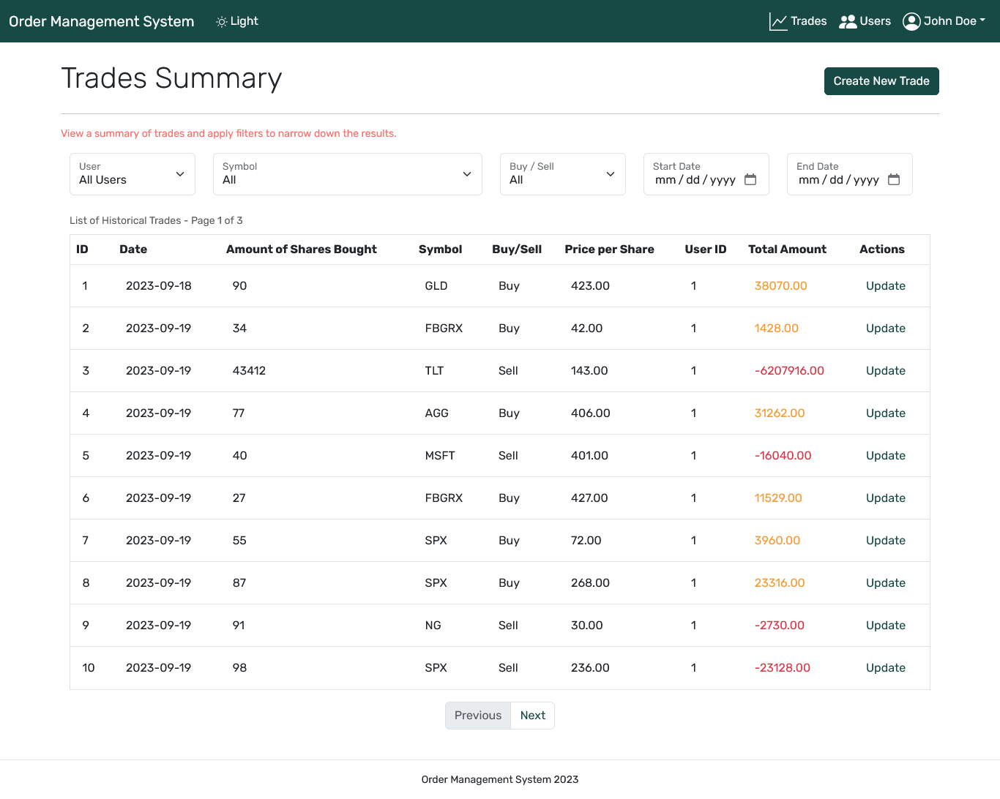
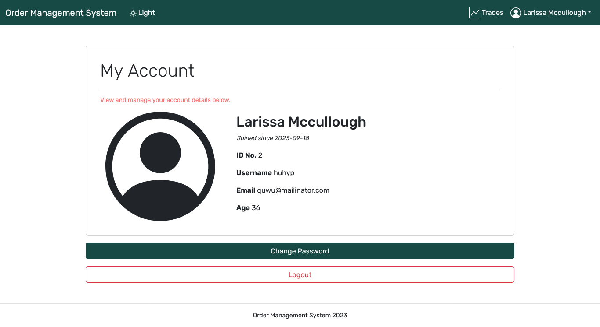

## Table of Contents

1. [Introduction](#1-introduction)
2. [Installation](#2-installation)
3. [Usage](#3-usage)
4. [Backend Documentation](#4-backend-documentation)
    - [API Routes](#41-api-routes)
    - [Database Models](#42-database-models)
    - [Handling Sensitive Information](#43-handling-sensitive-information)
5. [Frontend Documentation](#5-frontend-documentation)
    - [User Interface](#51-user-interface)
      - [Login](#511-login)
      - [Registration](#512-registration)
      - [Trades](#513-trades)
      - [Adding Trades](#514-adding-trades)
      - [Updating Trade](#515-updating-trade)
      - [Users](#516-users)
      - [MyAccount](#517-myaccount)
      - [ChangePassword](#518-changepassword)
      - [Dropdown Menu](#519-dropdown-menu)
    - [Development Notes](#52-development-notes)
      - [Vue Version](#521-vue-version)
      - [API Integration](#522-api-integration)
      - [Styling](#523-styling)
6. [Database Setup](#6-database-setup)
    - [Database Creation](#61-database-creation)
    - [Connection Details](#62-connection-details)
    - [Database Schema](#63-database-schema)
    - [Database Migrations](#64-database-migrations)

## 1. Introduction

This documentation provides an overview of the system's components, installation instructions, and usage guidelines.

## 2. Installation

To set up and run the Order Management System, follow these installation steps:

- Clone the repository:

```
git clone https://github.com/github-user-418848/cross-options-order-management-system.git
cd order-management-system
```

Install Python 3.8 if not already installed.

- Create a virtual environment (optional but recommended):

```
python3 -m venv venv
source venv/bin/activate  # On Windows: venv\Scripts\activate
```

Install backend dependencies:

```
cd backend
pip install -r requirements.txt
```

Install frontend dependencies:

```
cd frontend
npm install
```
## 3. Usage

To run the Order Management System, follow these steps:

- Start the backend server:

```
cd order_management_system_backend
python manage.py runserver
```

- Start the frontend:

```
cd order_management_system_frontend
npm run dev
```

Access the system through a web browser or API client.
## 4. Backend Documentation

### 4.1. API Routes

The Order Management System provides the following API routes:

#### User-related Routes

- `POST /api/login/`: Endpoint to log in a user.
- `POST /api/logout/`: Endpoint to log out a user. Requires authentication.
- `POST /api/register/`: Endpoint to register a new user.
- `POST /api/change-password/`: Endpoint to change a user's password. Requires authentication.
- `GET /api/profile/`: Endpoint to retrieve a user's profile. Requires authentication.
- `GET /api/users/`: Endpoint to retrieve a list of all users.

#### Trade-related Routes

- `GET /api/trades/`: Endpoint to retrieve a list of all trades.
- `GET /api/trades/{trade_id}/`: Endpoint to retrieve details of a specific trade.
- `POST /api/trades/`: Endpoint to create a new trade. Requires authentication.
- `PUT /api/trades/{trade_id}/update/`: Endpoint to update details of a specific trade. Requires authentication.

These routes allow interaction with the Order Management System, including user management and trade-related operations. Endpoints requiring authentication are marked accordingly.


### 4.2. Database Models

#### `CustomUser` Model

The `CustomUser` model represents the users of the Order Management System.

- Attributes:
  - `email` (EmailField): Unique email address of the user.
  - `username` (CharField): Unique username of the user.
  - `name` (CharField): User's full name.
  - `age` (PositiveIntegerField): User's age.
  - `is_active` (BooleanField): Indicates whether the user account is active.
  - `is_staff` (BooleanField): Indicates whether the user has staff permissions.
  - `date_joined` (DateField): Date when the user account was created.

The `CustomUser` model extends Django's `AbstractBaseUser` and `PermissionsMixin` to create a custom user model.

#### `Trade` Model

The `Trade` model represents individual trades made within the system.

- Attributes:
  - `user` (ForeignKey to `CustomUser`): User who executed the trade.
  - `date_of_execution` (DateField): Date when the trade was executed (auto-generated).
  - `amount_of_shares_bought` (PositiveIntegerField): Number of shares bought or sold in the trade.
  - `symbol_of_shares` (CharField with choices): Symbol of the traded shares.
  - `buy_sell` (CharField with choices): Indicates whether it's a 'Buy' or 'Sell' trade.
  - `price_per_share` (DecimalField): Price per share for the trade.
  - `total_amount_paid` (DecimalField, blank and null): Total amount paid for the shares in the trade (auto-calculated).

### 4.3. Handling Sensitive Information

#### Exclusion of Sensitive Data

I follow best practices for security by excluding sensitive information from version control using the `.gitignore` file. Specifically, the following sensitive information is excluded:

- Django Secret Key
- Debug Mode Settings
- Recaptcha Public and Private Keys

These are stored in a `.env` file, which is included in the `.gitignore`. This ensures that sensitive data remains secure and is not exposed in the repository.


## 5. Frontend Documentation

The frontend of the Order Management System is built using Vue.js, a popular JavaScript framework for building user interfaces. This section provides an overview of the frontend UI.

### 5.1 User Interface

The frontend of the system is organized into Vue components, each responsible for specific user interface elements.

#### 5.1.1. Login

This provides the login functionality for users. It includes fields for entering the username and password and a login button.


#### 5.1.2. Registration

This form is for user registration. It includes form fields for user details such as name, age, email, username, and password. It also integrates with reCAPTCHA for security.


#### 5.1.3. Trades

This includes its own trade details such as the date of execution, symbol of shares, buy/sell status, amount of shares bought, and price per share.

<br>
*Authenticated as an admin.*

<br>
*Authenticated as a user.*

#### 5.1.4. Adding Trades

This allows users to add new trade details. Admin or users can input trade information, including the symbol of shares, date of execution, amount of shares bought, and price per share.

<br>
*Authenticated as an admin.*

<br>
*Authenticated as a user.*

#### 5.1.5 Updating Trade

This is used for updating trade details. It retrieves trade information from the backend and allows users to modify the amount of shares bought and the price per share. This functionality is only allowed for Administrator


#### 5.1.6. Users

This component displays a list of all users in the system. Administrators can only view user details for now.


#### 5.1.7. My Account
This provides user account information and allows users to view and edit their profile details. It displays user-specific data such as name, email, and age.

<br>
*Authenticated as an admin.*

<br>
*Authenticated as a user.*

#### 5.1.9. Change Password

This allows users to change their passwords. Users must provide their current password and enter a new one.

<br>
*Authenticated as an admin.*

<br>
*Authenticated as a user.*

#### 5.1.10. Dropdown Menu

This provides a dropdown menu for user actions. Admin or users can access options like changing their password and logging out from this menu.

<br>
*Authenticated as an admin.*

<br>
*Authenticated as a user.*

### 5.2. Development Notes

#### 5.2.1. Vue Version

The frontend is built using Vue.js 3, the latest version of the framework.

#### 5.2.2. API Integration

The frontend communicates with the backend using RESTful API calls.

#### Axios Configuration

To ensure seamless communication with the backend, an Axios instance named apiClient is created with a base URL pointing to the backend API server. Additionally, an interceptor is added to include an ```Authorization``` header with the user's token for authenticated requests.

```
import axios from 'axios';
import store from '../store/';

const API_BASE_URL = import.meta.env.VITE_BACKEND_BASE_PATH;

const apiClient = axios.create({
  baseURL: API_BASE_URL,
});

// Add an interceptor to set the "Authorization" header with the token
apiClient.interceptors.request.use(config => {
  const token = store.state.token;
  if (token) {
    config.headers['Authorization'] = `Token ${token}`;
  }
  return config;
}, error => {
  return Promise.reject(error);
});
```

#### Authentication

The following functions handle user authentication:

Login: Logs in a user and returns an authentication token.

```
export const login = async (loginData) => {
  return apiClient.post('/login/', loginData);
};
```
Register: Registers a new user and returns an authentication token.

```
export const register = async (registerData) => {
  return apiClient.post('/register/', registerData);
};
```
Logout: Logs out a user.

```
export const logout = async () => {
  return apiClient.post('/logout/')
};
```

#### Trade Operations

Trades can be created, retrieved, updated, and deleted using the following functions:

Get Trades: Retrieves a list of trades based on filters such as date, buy/sell, and symbol.

```
export const getTrades = async (page, startDate, endDate, buySell, symbol) => {
  const config = {
    params: {
      page: page,
      start_date: startDate,
      end_date: endDate,
      buy_sell: buySell,
      symbol: symbol,
    },
  };

  return apiClient.get('/trades/', config)
    .then((response) => {
      const trades = response.data;
      return trades;
    })
    .catch((error) => {
      console.error('Error fetching trades:', error);
      throw error;
    });
};
```
Get Trade by ID: Retrieves details of a specific trade by its ID.

```
export const getTradeById = async (id) => {
  return apiClient.get(`/trades/${id}`)
    .then((response) => {
      const trades = response.data;
      return trades;
    })
    .catch((error) => {
      console.error('Error fetching trades:', error);
      throw error;
    });
};
```
Create Trade: Creates a new trade.

```
export const createTrade = async (tradeData) => {
  return apiClient.post('/trades/', tradeData);
};
```
Update Trade: Updates the details of a specific trade.

```
export const updateTrade = async (tradeData, id) => {
  return apiClient.put(`/trades/${id}/update/`, tradeData);
}
```

#### User Operations

User-related functions allow for managing users and fetching user profiles:

Get Users: Retrieves a list of users with optional filters such as age, date range, and keyword search.

```
export const getUsers = async (page, age, startDate, endDate, keyword) => {
  const config = {
    params: {
      page: page,
      age: age,
      start_date: startDate,
      end_date: endDate,
      keyword: keyword,
    },
  };
  return apiClient.get('/users/', config)
    .then((response) => {
      const users = response.data;
      return users;
    })
    .catch((error) => {
      console.error('Error fetching users:', error);
      throw error;
    });
};
```
Get User Profile: Retrieves the profile of the authenticated user.

```
export const getProfile = async () => {
  return apiClient.get(`/profile/`)
  .then((response) => {
    const profile = response.data;
    return profile;
  })
  .catch((error) => {
    console.error('Error fetching profile:', error);
    throw error;
  });
}
```
Change Password: Allows a user to change their password.

```
export const changePassword = async (formData)=> {
  return apiClient.post('/change-password/', formData);
}
```

These functions enable seamless interaction with the Order Management System's backend API, facilitating user authentication and trade/user management.


#### 5.2.3. Styling

Styling is handled using Bootstrap 5 and custom CSS.


## 6. Database Setup

For development purposes, I just used SQLite as the database. SQLite is a file-based database that doesn't require a separate server installation. Follow these simple steps to set up your SQLite database:

### 6.1. Database Creation:
If you haven't already created an SQLite database file, you can do so by running the following command in your project's root directory:
```
python manage.py migrate
```
This command will create an SQLite database file named `db.sqlite3` by default.

### 6.2. Connection Details:
The database connection is established automatically using the `db.sqlite3` file located in your project's root directory.

### 6.3. Database Schema:
Our application uses the following tables in the SQLite database:
    
`users_customuser`: Stores user information.<br>
`trades_trade`: Stores trade records.

### 6.4. Database Migrations:
If you make changes to your database schema during development, you can apply migrations using the following command:

```
python manage.py makemigrations
python manage.py migrate
```

This will update the database schema to match the changes in your Django models.